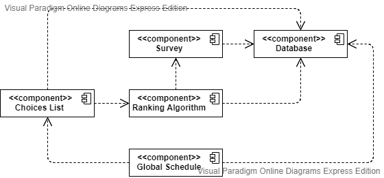

# openCX-MIB_Refugees Development Report

Welcome to the documentation pages of the module CORE of the **openCX** project!

You can find here detailed information about the project's module, from a high-level vision to low-level implementation decisions, a kind of Software Development Report, organized by discipline (as of RUP):

* Business modeling 
  * [Product Vision](#Product-Vision)
  * [Elevator Pitch](#Elevator-Pitch)
* Requirements
  * [Use Case Diagram](#Use-case-diagram )
  * [User stories](#User-stories)
  * [Domain model](#domain-model)
* Architecture and Design
  * [Architectural and design decisions]()
  * [Technological architecture]()
  * [Logical architecture]()
* Implementation
  * [Source code]()
  * [Issues](): feature requests, bug fixes, improvements.
* Test
  * [Automated tests](): Functional tests, integration tests, acceptance tests, as much automated as possible.
* Change management
  * [Issues at Github]()
* Project management
  * Tasks management tool 

So far, contributions are exclusively made by the initial team, but we hope to open them to the community, in all areas and topics: requirements, technologies, development, experimentation, testing, etc.

Please contact us! 

Thank you!

João Afonso Pinto Pereira\
José João Coelho Dias\
Maria João Mendes Ribeiro\
Patrícia Ferreira Rocha

---

## Product Vision

Our vision is to help conference attendees manage their time by telling them which lectures are more interesting for them according to their interests and building a customized schedule that fits their preferences.

This way, CORE is an app for conference agenda/logistics that helps attendees **save time** by choosing the lectures they want to attend within a tailored list.

---

## Elevator Pitch

Our platform concerns two stages:

First, the attendee answers a survey with personal information such as his/her interests or preferences. Based on this information, a recommendation algorithm suggests lectures that match those interests and the attendee is able to choose the ones he/she is truly interested in attending.

In the following stage, the organizers have access to the number of interested people for each lecture and plan the schedule or group lectures with similar topics.

Finally, the attendee has access to a schedule with the lectures he/she previously chose.

---

## Requirements

In this section, we describe the requirements for our module: functional and non-functional requirements.

### Use case diagram

---

### User stories for the attendee

| Identifier | Effort to implement | Importance | Description |
| -- | -- | -- | -- |
| US06 | S | Must have | As an attendee, I want to start the survey. |
| US05 | L | Must have | As an attendee, I want to fill a form to provide my informations. |
| US07 | XL | Must have | As an attendee, I want to submit my answers to obtain a list of matches. |
| US02 | M | Must have | As an attendee, I want to choose the lectures I want to attend to provide that information to the system. |
| US01 | M | Must have | As an attendee, I want to check my personal schedule to see when/where are the lectures I intend to go. |
| US03 | M | Must have | As an attendee, I want to sign-up to create an account in the platform. |
| US04 | M | Must have | As an attendee, I want to authenticate into the system to have access to my account. |
| US08 | S | Should have | As an attendee, I want to reach the menu. |
| US09 | M | Should have | As an attendee, I want to review the survey to correct answers. |
| US10 | S | Could have | As an attendee, I want to consult the conference lectures to know the program. |
| US11 | S | Could have | As an attendee, I want to consult my schedule to see the lectures I will attend. |
| US12 | M | Could have | As an attendee, I want to check conference information. |
| US13 | S | Could have | As an attendee, I want to cancel the survey to stop answering the form. |

### User stories for the organizer

| Identifier | Effort to implement | Importance | Description |
| -- | -- | -- | -- |
| US14 | M | Must have | As an organizer, I want to authenticate into the system to have access to my account. |
| US15 | M | Must have | As an organizer, I want to check the user preferences to plan the schedule. |
| US16 | M | Must have | As an organizer, I want to plan the conference schedule to close the program. |
| US17 | S | Should have | As an organizer, I want to reach the menu. |
| US18 | S | Could have | As an organizer, I want to group lectures with similar topics to create sessions with a specific theme. |
| US19 | M | Could have | As an organizer, I want to consult the complete program of the conference.

All user stories can be found [here on Trello.](https://trello.com/b/tP9QxHeT/fugitivos-do-mib)

---

### Mockups

Mockups can also be found as attachments in the user stories on [Trello](https://trello.com/b/tP9QxHeT/fugitivos-do-mib).

### Domain model

The Conceptual Data Model describes the relationships between all entities in a UML class diagram.

#### Class diagram
On that premise, in order to organize and structure our database, a UML class diagram was built,
as well as the attributes and the relationships between them.

---
## Architecture and Design

### Component Diagram

### Deployment Diagram

