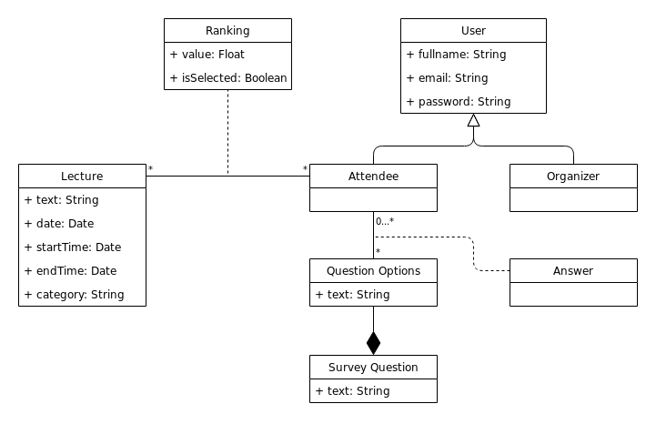

# openCX-MIB_Refugees Development Report

Welcome to the documentation pages of the module CORE of the **openCX** project!

You can find here detailed information about the project's module, from a high-level vision to low-level implementation decisions, a kind of Software Development Report (see [template](https://github.com/softeng-feup/open-cx/blob/master/docs/templates/Development-Report.md)), organized by discipline (as of RUP): 

* Business modeling 
  * [Product Vision](#Product-Vision)
  * [Elevator Pitch](#Elevator-Pitch)
* Requirements
  * [Use Case Diagram](#Use-case-diagram )
  * [User stories](#User-stories)
  * [Domain model](#domain-model)
* Architecture and Design
  * [Architectural and design decisions]()
  * [Technological architecture]()
  * [Logical architecture]()
* Implementation
  * [Source code]()
  * [Issues](): feature requests, bug fixes, improvements.
* Test
  * [Automated tests](): Functional tests, integration tests, acceptance tests, as much automated as possible.
* Change management
  * [Issues at Github]()
* Project management
  * Tasks management tool 

So far, contributions are exclusively made by the initial team, but we hope to open them to the community, in all areas and topics: requirements, technologies, development, experimentation, testing, etc.

Please contact us! 

Thank you!

João Afonso Pinto Pereira\
José João Coelho Dias\
Maria João Mendes Ribeiro\
Patrícia Ferreira Rocha

---

## Product Vision

Our platform concerns two stages:

First, the attendee answers a survey with personal information such as his/her interests or preferences. Based on this information, a clustering algorithm suggests lectures that match those interests and the attendee is able to choose the ones he/she is truly interested in attending.

In the following stage, the organizers have access to the number of interested people for each lecture and plan the schedule or group lectures with similar topics.

Once the schedule is closed, the attendee has access to a schedule with the lectures he/she previously chose.

---

## Elevator Pitch

Mobile app for conference agenda/logistics. 
-  Save Time
- Get Feedback

---

## Requirements

In this section, you should describe all kinds of requirements for your module: functional and non-functional requirements.

Start by contextualizing your module, describing the main concepts, terms, roles, scope and boundaries of the application domain addressed by the project.

### Use case diagram

### User stories
[User Story Map on Trello](https://trello.com/b/tP9QxHeT/fugitivos-do-mib  )
                

---

### Mockups

### Domain model

The Conceptual Data Model describes the relationships between all entities in a UML class diagram.

#### Class diagram
On that premise, in order to organize and structure our database, a UML class diagram was built,
as well as the attributes and the relationships between them.

