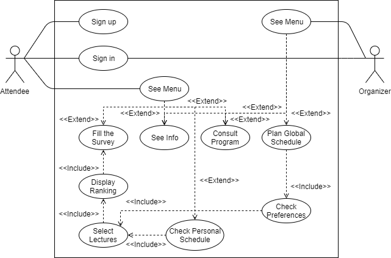

# openCX-MIB_Refugees Development Report

Welcome to the documentation pages of the module CORE of the **openCX** project!

You can find here detailed information about the project's module, from a high-level vision to low-level implementation decisions, a kind of Software Development Report, organized by discipline (as of RUP):

* Business modeling 
  * [Product Vision](#Product-Vision)
  * [Elevator Pitch](#Elevator-Pitch)
* Requirements
  * [Use Case Diagram](#Use-Case-Diagram)
  * [User Stories](#User-Stories)
  * [Acceptance Tests](#Acceptance-Tests)
  * [Mockups](#Mockups)
  * [Domain Model](#Domain-Model)
* Architecture and Design
  * [Logical Architecture](#Logical-Architecture)
  * [Physical Architecture](#Physical-Architecture)
  * [Prototype](#Prototype)
* [Test](#Test)
* [Project Management](#Project-management)

So far, contributions are exclusively made by the initial team, but we hope to open them to the community, in all areas and topics: requirements, technologies, development, experimentation, testing, etc.

Please contact us! 

Thank you!

João Afonso Pinto Pereira\
José João Coelho Dias\
Maria João Mendes Ribeiro\
Patrícia Ferreira Rocha

---

## Product Vision

Our vision is to help conference attendees manage their time by telling them which lectures are more interesting for them according to their interests and building a customized schedule that fits their preferences.

This way, CORE is an app for conference agenda/logistics that helps attendees **save time** by choosing the lectures they want to attend within a tailored list.

---

## Elevator Pitch

Our platform concerns two stages:

First, the attendee answers a survey with personal information such as his/her interests or preferences. Based on this information, a recommendation algorithm suggests lectures that match those interests and the attendee is able to choose the ones he/she is truly interested in attending.

In the following stage, the organizers have access to the number of interested people for each lecture and plan the schedule or group lectures with similar topics.

Finally, the attendee has access to a schedule with the lectures he/she previously chose.

---

## Requirements

In this section, we describe the requirements for our module: functional and non-functional requirements.

### Use Case Diagram

Our use case aims at specifying the expected system behavior from the end user's perspective. This way, we describe the relationships between the system and our two actors: the attendee - a generic participant - and the organizer of the conference.

The organizer already has an account. Therefore, the sign up is exclusive for participants. Both actors can authenticate into the system. After this, depending on the actor a different menu is showed. Although the design remains the same different navigation options are presented: from the menu, the attendee is able to fill the survey, check his/her customized schedule, see conference information and consult the program; on the other hand, the organizer is able to plan the schedule, check the attendees' preferences and see conference information, as well. After filling the survey, the attendee is given a ranking of lectures and is able to select lectures within that list. After choosing the lectures, his/her schedule is build. 

---

### User Stories 

All user stories can be found [here on Trello.](https://trello.com/b/tP9QxHeT/fugitivos-do-mib)
In the following sections, all user stories are separated by user (attendee and organizer) and ordered by importance.

#### User Stories For The Attendee

| Identifier | Effort to implement | Importance | Description |
| -- | -- | -- | -- |
| US01 | L | Must have | As an attendee, I want to fill a form to provide my informations. |
| US02 | XL | Must have | As an attendee, I want to submit my answers to obtain a list of matches. |
| US03 | M | Must have | As an attendee, I want to choose the lectures I want to attend to provide that information to the system. |
| US04 | M | Must have | As an attendee, I want to check my personal schedule to see when/where are the lectures I intend to go. |
| US05 | M | Must have | As an attendee, I want to sign-up to create an account in the platform. |
| US06 | M | Must have | As an attendee, I want to authenticate into the system to have access to my account. |
| US07 | S | Should have | As an attendee, I want to reach the menu. |
| US08 | M | Should have | As an attendee, I want to review the survey to correct answers. |
| US09 | S | Could have | As an attendee, I want to consult the conference lectures to know the program. |
| US10 | S | Could have | As an attendee, I want to consult my schedule again to see the lectures I will attend. |
| US11 | M | Could have | As an attendee, I want to check conference information. |
| US12 | S | Could have | As an attendee, I want to cancel the survey to stop answering the form. |

#### User Stories For The Organizer

| Identifier | Effort to implement | Importance | Description |
| -- | -- | -- | -- |
| US13 | M | Must have | As an organizer, I want to authenticate into the system to have access to my account. |
| US14 | M | Must have | As an organizer, I want to check the user preferences to plan the schedule. |
| US15 | M | Must have | As an organizer, I want to plan the conference schedule. |
| US16 | S | Should have | As an organizer, I want to reach the menu. |
| US17 | S | Could have | As an organizer, I want to consult the conference lectures to know the program. |

---

### Acceptance Tests

Acceptance testing consists of formal testing with respect to the user needs, requirements, and business processes conducted to determine whether or not a system satisfied the acceptance criteria. Follows a description of the acceptance tests using the Gherkin syntax:

| User Story(ies) | Scenario | Acceptance test |
| -- | -- | -- |
| US01 | Fill the survey | **Given** I am on the survey **and** I answered the question **when** I click the "Next" button **then** I should see the next question. |
| US02 | Submit answers | **Given** I am on the survey **and** I answered all questions **when** I click the "Submit" button **then** I should see my matched lectures. |
| US03 | Choose lectures | **Given** I am on the lectures ranking **when** I select some lectures **then** I should see the lectures I selected. |
| US04 | Check schedule | **Given** I already completed the survey **and** I selected the lectures I want to go **when** I click the confirmation button **then** I should see my personal schedule. |
| US05 | Sign-up | **Given** I am on the sign up **and** I enter a valid fullname, email, password and confirm the password **when** I click the "Sign up" button **then** I should see the sign up confirmation **and** go to the main page. |
| US06, US13 | Sign in | **Given** I am on the sign in **and** I enter a registered email and corresponding password **when** I click the "Sign in" button **then** I should see the sign in confirmation **and** go to the main page. |
| US07, US16 | Access menu | **Given** I am authenticated **when** I am on the menu page **then** I should see all the navigation options. |
| US08 | Review survey | **Given** I am on the survey **when** I complete the survey **then** I can review my answers **and** correct them. |
| US09, US17 | Check program | **Given** I am on the menu **when** I choose to check the program **then** I should see a list of all the lectures organized by day. |
| US10 | Check schedule | **Given** I am on the menu **and** I already did the survey **when** I choose to check the schedule **then** I should see the lectures I want to attend. |
| US11 | Check conference information | **Given** I am on the menu **when** I choose to check conference information **then** I should see the conference location, date, and other details. |
| US12 | Cancel survey | **Given** I am on the survey **when** I click the "Cancel" button **then** I should return to the main page. |
| US14 | Check preferences | **Given** I am on the menu **when** I choose to check preferences **then** I should see a summary of the attendees' preferences. |
| US15 | Plan schedule | **Given** I am on the user preferences **when** I select a lecture and change the start/end time **then** I should see the change on the schedule. |

---

### Mockups

Mockups can also be found as attachments in the user stories on [Trello](https://trello.com/b/tP9QxHeT/fugitivos-do-mib).

---

### Domain Model

The Conceptual Data Model describes the relationships between all entities in a UML class diagram.

#### Class Diagram
On that premise, in order to organize and structure our database, a UML class diagram was built,
as well as the attributes and the relationships between them.

---
## Architecture and Design

### Logical Architecture
The software that has been developed follows the MVC (Model-View-Controller) architectural pattern by structuring the system into three logical parts that interact with each other.

### Physical Architecture

Our project was fully developed using Flutter - an emerging framework for mobile development that supports both iOS and Android - combined with the open-cx backend.

Concerning the architecture itself, it has 2 main parts:
* The server-side component.
* The smartphone-based components including attendee and organizer devices. 

Therefore, focusing on principal features, through the UI screens the attendee fill the survey, access to personal ranking and then choose the lectures he/she attendee to go. All the information are provide/saved through database server. The organizer access to new information from attendee and plan conference according to that. The following UML diagram reflet the above logic.

#### Component Diagram

#### Deployment Diagram

### Prototype

---

At the end of iteration 0, the technologies had already been chosen. All user stories were carefully described, ordered by importance and labeled according to the effort it would take to implement. After this, the first tasks were assigned to each group member and kept being updated on Trello. Finally, a first prototype of the survey was developed as well. 

### Test
To assure the quality of the features developed, we intend to test:
- Sign-in and Sign-up: by data verification and validity;
- Menu: check if each menu option redirects to the correct feature;
- Survey: check if the selected answers appear correctly in the review UI screen;
- Schedule: check if a lecture is correctly assigned to the schedule when the attendee selects it in the ranking UI screen;
- Program: check if the lecture's start and end time is updated in the program when the organizer changes it.

* Acceptance tests have already been described above.

---
### Project Management

Project management is a crucial point when leading with developing software projects. This way, we used [Trello](https://trello.com/b/tP9QxHeT/fugitivos-do-mib), an easy-to-use project management tool capable of registering tasks, assign them to different members and monitor progress (To Do, Doing, Done). Besides that, it allows to attach images and label tasks.
